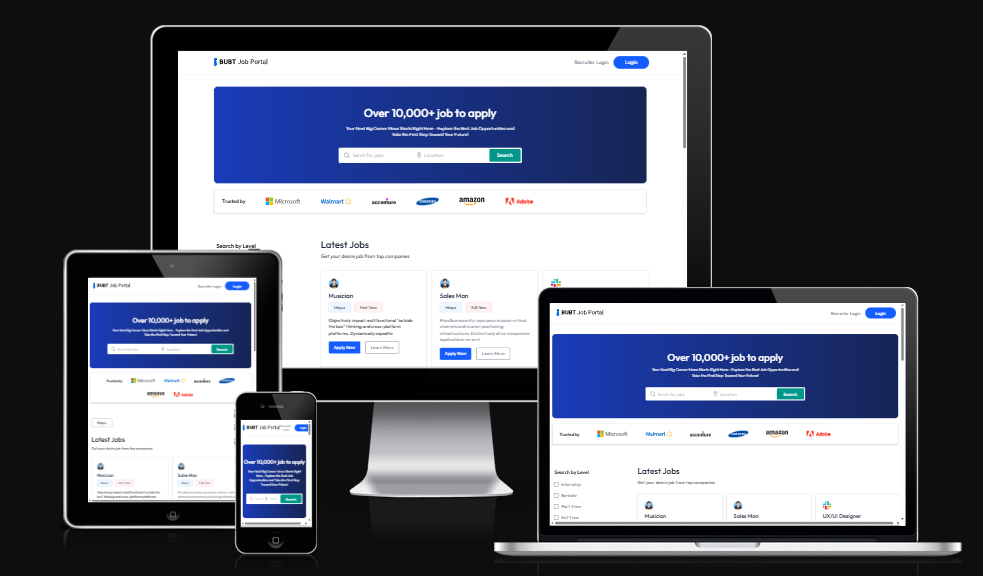

# 🚀 Bubt Job Portal: Full-Stack Job Portal & Experience Suite

CareerHub Pro is a high-performance, full-stack job portal built with the MERN stack, integrated with Clerk Auth, and secured with Arcjet. Beyond standard job applications, this platform features an Expert Experience Feed for senior developers and a Professional Resume Builder with instant PDF downloads.




---

## ✨ Key Features

### 🏢 For Recruiters
* **Company Dashboard:** Manage job listings and track applications.
* **Applicant Tracking:** Review candidate profiles and change application statuses (Pending, Accepted, Rejected).
* **Security:** Rate-limited job posting to prevent spam using Arcjet.

### 🎓 For Job Seekers
* **Smart Search:** Filter jobs by category, location, and salary.
* **User Profiles:** Build a comprehensive professional portfolio.
* **Resume Builder:** Generate and download a print-ready PDF resume directly from your profile data.
* **Experience Feed:** Read and share interview experiences and career tips from Senior Developers.

### 🛡️ Technical Excellence
* **Arcjet Integration:** DDoS protection and intelligent rate limiting.
* **Authentication:** Multi-factor authentication via Clerk.
* **Cloudinary:** Optimized image hosting for profiles and company logos.
* **Sentry:** Real-time error tracking and performance monitoring.

---

## 🛠️ Tech Stack

**Frontend:**
* React.js (Vite)
* Tailwind CSS (Modern UI/UX)
* Clerk (Authentication)
* Lucide React (Icons)
* Axios & React-Toastify

**Backend:**
* Node.js & Express.js
* MongoDB (Mongoose)
* Arcjet (Security & Rate Limiting)
* Cloudinary (Image Management)
* Sentry (Monitoring)

---

## 🛡️ Security Implementation
This project uses Arcjet to ensure high availability and security:

- Rate Limiting: Prevents API abuse.

- Bot Detection: Blocks malicious scrapers.

- Shield: Protects against SQL injection and common exploits.

## ⚙️ Environment Variables

To run this project, you will need to add the following environment variables to your `.env` files.

### Backend (`/server/.env`)
```env
PORT=5000
JWT_SECRET=your_jwt_secret
MONGODB_URI=your_mongodb_connection_string
SENTRY_DSN=your_sentry_dsn

CLOUDINARY_NAME=your_name
CLOUDINARY_API_KEY=your_key
CLOUDINARY_SECRET_KEY=your_secret

CLERK_WEBHOOK_SECRET=your_webhook_secret
CLERK_PUBLISHABLE_KEY=your_clerk_pub_key
CLERK_SECRET_KEY=your_clerk_secret_key

ARCJET_KEY=your_arcjet_key
```
### Frontend (`/client/.env`)
```
VITE_CLERK_PUBLISHABLE_KEY=your_clerk_pub_key
VITE_BACKEND_URL=http://localhost:5000
```

## 🚀 Getting Started

### 1. Clone the repository
```
git clone https://github.com/istiakAHMEDsaad/job-portal-sdp-4
```

### 2. Install Dependencies
```
# Install backend dependencies
cd server
npm install

# Install frontend dependencies
cd client
npm install
```

### 3. Run the Project
```
# Run backend (from /server)
npm run server

# Run frontend (from /client)
npm run dev
```


## 1. How to contribute :heart_decoration:?

- Total 5 branches :speaking_head:
  - main
  - clinet
  - client-test
  - server
  - server-test

__Step 1:__ First get the latest code from the main branch!
```
git clone https://github.com/istiakAHMEDsaad/job-portal-sdp-4.git
```
- _Which branch you need to use?_
  - If you are working on `client` use `client-test`
  - If you are working on `server` use `server-test`

__Step 2:__ Checkout that branch, use above branches (assume that we are using `client-test` branch)
```
git checkout client-test
```
__Step 3:__ :warning: Before starting any coding, always pull latest updates:
```
git pull origin client-test
```
__Step 4:__ :white_check_mark: After coding:
```
git add .
git commit -m "Updated navbar"
git push origin client-test
```
__Step 5:__ If you faced `non-fast-forward` error use rebase flag and push again using "step 4"
```
git pull origin client-test --rebase
```

__Step 6:__ :warning: After i merge the test branch to main branch please get the updated code using:
```
git checkout main
git pull origin main
```

- Optional :warning: ( Your local changes to the following files would be overwritten by merge `git fetch origin`) problem:

  - __Solve 1:__
  ```
  # don’t need their local edits
  git restore .

  # or if some files were newly added
  git reset --hard

  # last pull code
  git pull origin <branch-name>
  ```
  - __Solve 2:__
  ```
  # Save the uncommitted work
  git stash

  # Pull the latest code:
  git pull origin <branch-name>

  # Bring the saved work back:
  git stash pop
  ```
  
  - __Solve 3:__
  ```
  git fetch origin

  # Option 1 (safe merge)
  git merge origin/server-test

  # quite vim ':qw' and make a commit
  git merge origin/branch-name

  # Option 2 (cleaner, rewrite history):
  git rebase origin/server-test

  # If you get conflicts, resolve them, then run:
  git add .
  git rebase --continue

  #Once the merge or rebase is done:
  git push origin branch-name

  # add -> commit -> fetch -> merge -> again add commit push
  ```
